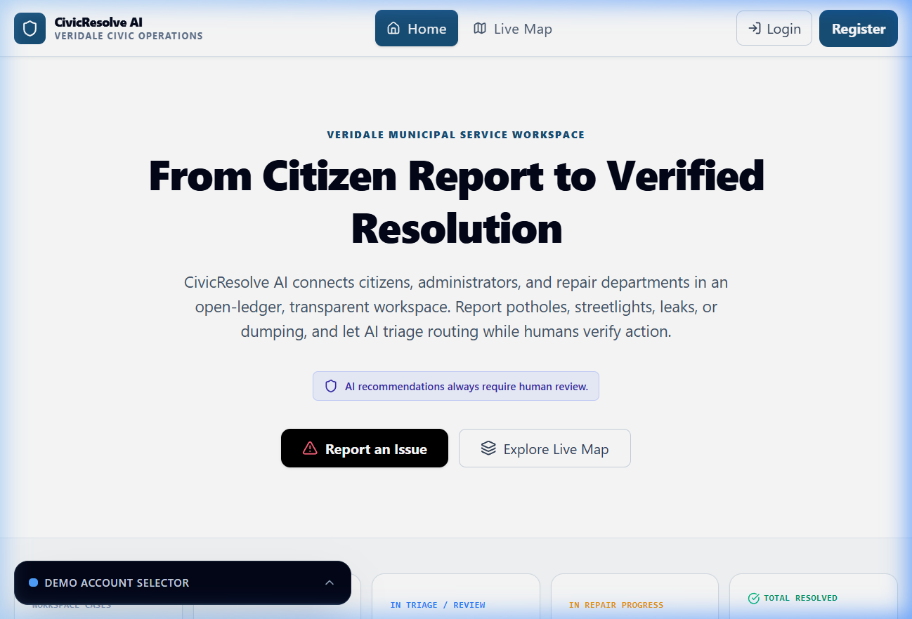
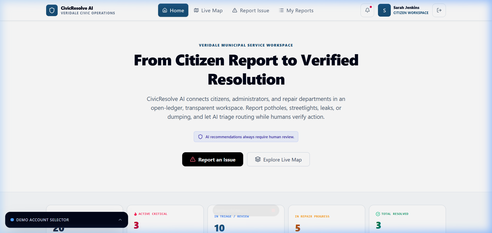
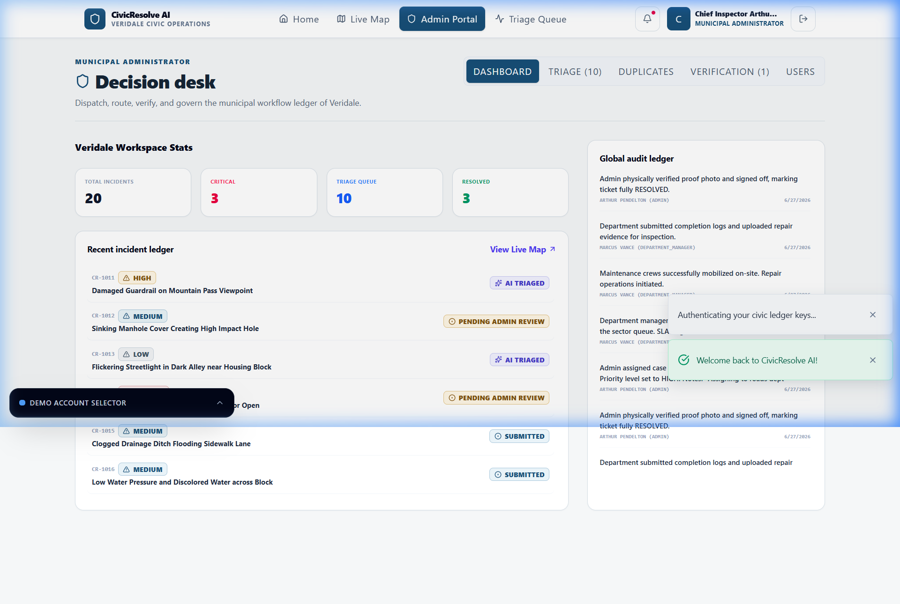
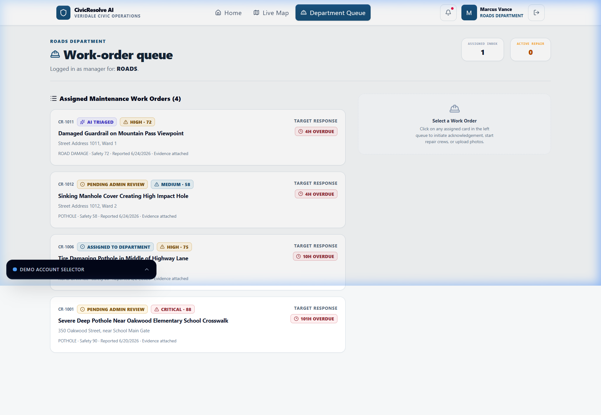
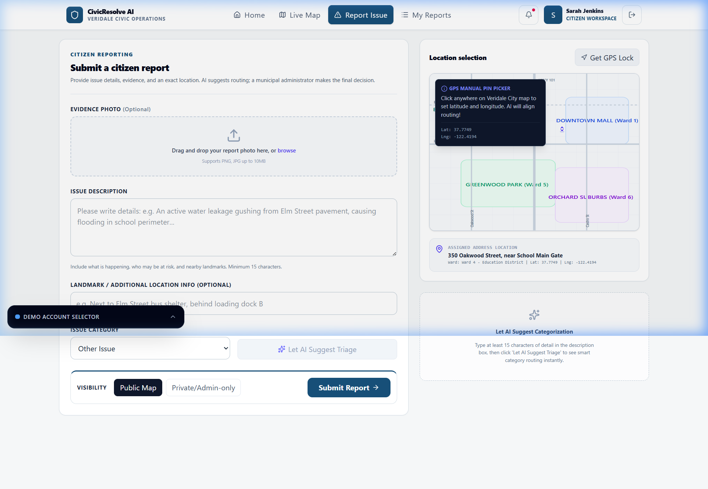

# 🏛️ CivicResolve AI

> **A smart complaint tracker for your city — powered by AI, built for transparency.**

Citizens report municipal problems → AI classifies & routes them → Departments fix them → Admin verifies → Citizens confirm.



---

## 🤔 The Problem

Ever reported a pothole and **never heard back?** That's the reality of most civic complaint systems:

- ❌ No transparency — complaints disappear into a black hole
- ❌ Slow routing — nobody knows which department should handle it
- ❌ No priority system — a dangerous live wire is treated the same as a cracked tile
- ❌ Duplicate complaints — 20 people report the same pothole = 20 separate tickets
- ❌ No proof of repair — departments say "fixed!" but nothing changed
- ❌ No citizen recourse — once "closed", there's no way to reopen

---

## ✅ Our Solution

**CivicResolve AI** fixes all of this with one platform:

| Feature | How It Helps |
|---|---|
| 🤖 **AI Auto-Classification** | Gemini AI reads the complaint and instantly identifies category, severity & correct department |
| 📊 **Priority Scoring** | Formula-based ranking (0-100) so critical hazards always come first |
| 🔍 **Duplicate Detection** | Reports within 150m of each other get auto-clustered |
| 📸 **Photo Evidence Required** | Departments must upload proof of repair |
| ✅ **Before vs After Verification** | Admin compares original photo with repair photo |
| 🔁 **Citizen Reopen** | If the fix is bad, citizens can reopen the case |
| 📝 **Full Audit Trail** | Every action is permanently logged — nothing gets deleted |

---

## 🔄 How It Works (Simple Flow)

```
👤 Citizen                  👨‍💼 Admin                  🔧 Department
   │                           │                           │
   ├── Reports issue ──────────►                           │
   │   (photo + location)      │                           │
   │                           │                           │
   │   ◄── AI analyzes ────────┤                           │
   │       (category,severity) │                           │
   │                           │                           │
   │                           ├── Approves & Dispatches ──►
   │                           │                           │
   │                           │                    Accepts & Repairs
   │                           │                           │
   │                           │   ◄── Uploads proof ──────┤
   │                           │                           │
   │                           ├── Verifies (Before/After) │
   │                           │                           │
   │   ◄── Notified: RESOLVED! │                           │
   │                           │                           │
   ├── Can REOPEN if bad fix ──►                           │
```

---

## 👥 Three User Roles

### 👤 Citizen (Sarah Jenkins)
Report issues, track status, upvote others' reports, reopen bad fixes.



### 👨‍💼 Admin (Arthur Pendelton)
See all stats, review AI suggestions, dispatch to departments, verify repairs.



### 🔧 Department Manager (Marcus Vance — Roads)
See only your department's queue, accept tickets, do repairs, upload proof.



---

## 📝 Report Submission

Citizens fill in a description, upload a photo, and pin the location on a map. AI instantly suggests the category and department.



---

## 🧠 AI Under the Hood

- Uses **Google Gemini 2.5 Flash** to analyze complaints
- Predicts: **category**, **severity (1-5)**, **department**, **safety risk**
- If no API key → falls back to **rule-based heuristics** (app never breaks!)
- AI only **recommends** — a human admin always makes the final call

---

## 🛠️ Tech Stack

| Layer | Tech |
|---|---|
| Frontend | React 19, Vite, Tailwind CSS, Lucide Icons |
| Backend | Node.js + Express |
| AI | Google Gemini 2.5 (via `@google/genai`) |
| Database | Local JSON mock (Firebase-compatible) |
| Language | TypeScript |

---

## 🚀 Run It Yourself

```bash
npm install        # Install dependencies
npm run dev        # Start at http://localhost:3000
```

Optional: Add `GEMINI_API_KEY=your_key` to a `.env` file for real AI (works without it too).

---

## 📄 License

Apache-2.0
